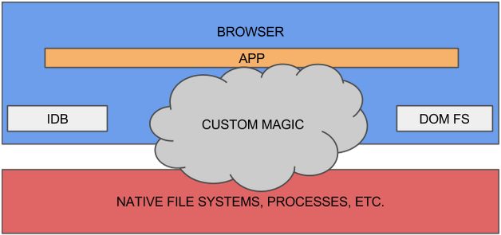
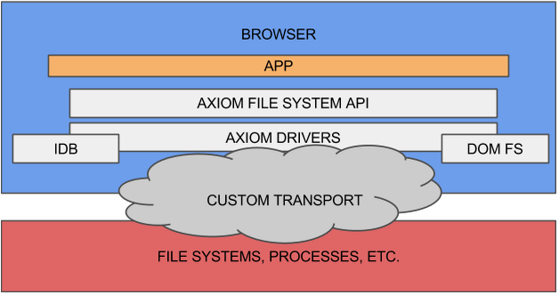

# Axiom: Universal File System, Streams, and Processes API for JS

Axiom is a cross browser library that provides primitives for File Systems, Streams, and Processes.

Axiom is not a "framework" or a "toolkit".  You do not have to redesign your application to use Axiom.  Axiom doesn't mind if you're already using other JavaScript libraries.  Axiom's main goal in life is to a buffer between your application and stuff that fits into its file system view of the world.

## File Systems on the web

If you want to work with files on the web you've got a number of options.  You can roll your your own Indexed DB based file system or use Chrome's DOM File System to store thing on the client side.  Need cloud based storage?  You can depend on one or more web APIs for Google Drive, OneDrive, DropBox, Box.net, or others.

If you've got more specialized needs, something like [Atom](https://atom.io/) or [Cloud9](https://c9.io/), you might cook up your own way of talking to a node.js server or write a native app that embeds a browser in order to talk directly to the local machine.

The situation can be crudely summarized with this diagram:

The cross-browser portion of your app lives in the blue, the web browser or something like it.  For file access, you come up with a scheme to get a the relevant file system data.  Each back end is a little different though, so you'll probably choose the one thing that seems right at the time.  If your needs change, you'll have to do some refactoring later.

If you end up writing your own server or custom browser embedding, you'll need a file system API to go along with it.

Axiom adds a normalization layer to this story.

The Axiom library works in modern web browsers *and* node.js, meaning that your file system code can be much more portable.

Clients that depend on Axiom conduct all file system access through the Axiom API.  File System drivers provided by third parties handle the access to and from the underlying storage.

Clients with special needs can provide their own file system drivers.  As a bonus, most custom solutions can be solved with just a new transport layer (a way for the browser to speak to your custom storage back end).

## Processes and Streams

The Axiom file system API also covers processes and streams.

Process support means that clients can invoke any path that is marked as executable.  When this happens, a callback registered when the file was created will be invoked.  The callback will receive arguments provided by the caller, along with stdin, stdout, and stderr streams and an event stream for out-of-band signaling.  The callback can execute asynchronously, and exit with an 'ok' or 'error' disposition and a result value.

This provides great freedom in decoupling caller and callee.  The conventions around passing arguments and communicating are well defined and flexible enough to cover a large number of situations.  It's also inherently "remotable", meaning that you can write a general proxy which forwards calls to another origin, or across the network.

We've used this to create a "pnacl" command which can load and arbitrary [pnacl](https://www.chromium.org/nativeclient/pnacl) port from the network (such as vim or python) and run it from with our [web_shell](../samples/web_shell) sample application.  The same approach could work for asm.js, or "virtual" executables hosted by a cloud service.
